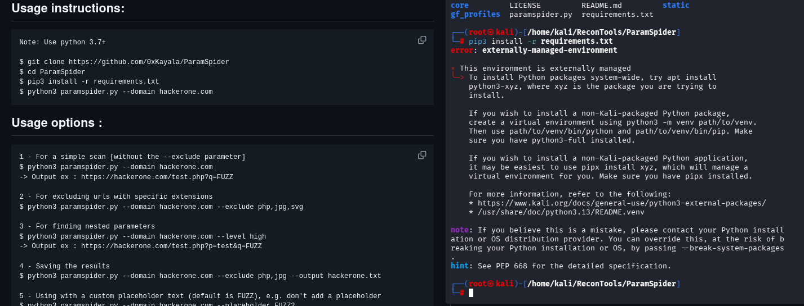
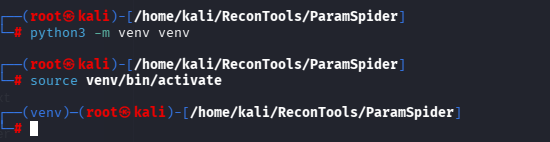
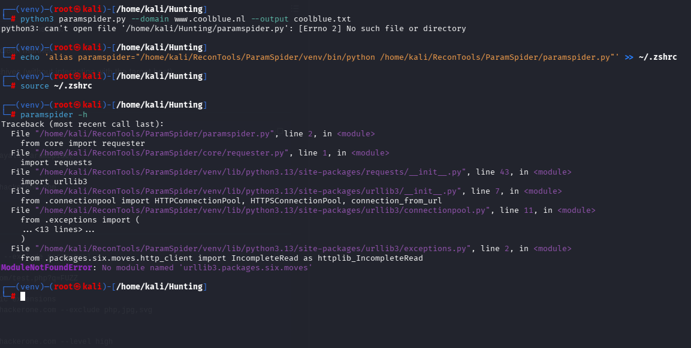
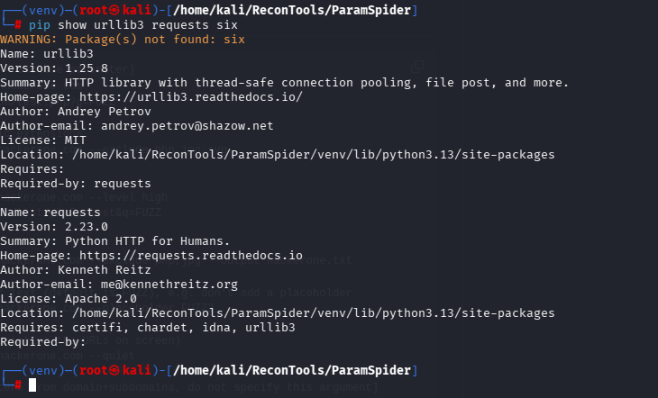
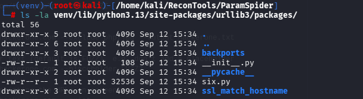
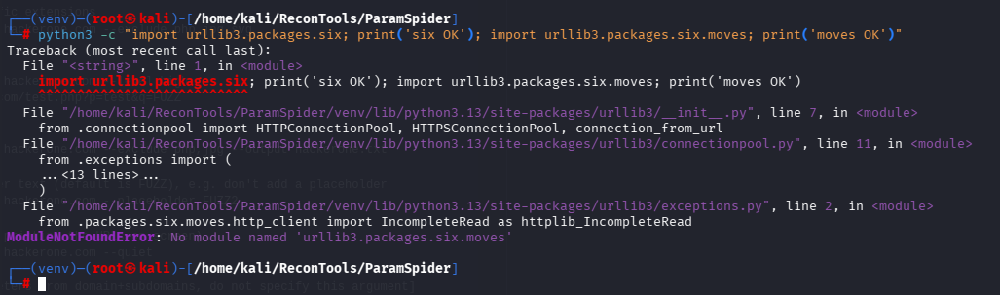
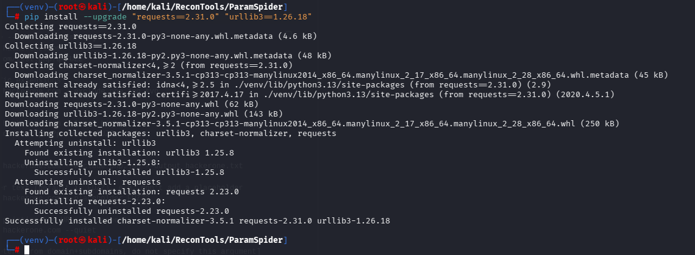

# 🔎 ParamSpider — Kali Linux Setup & Troubleshooting

<p align="center">
  <b>A hands-on cybersecurity lab documenting installation, dependency debugging, and validation of ParamSpider on Kali Linux.</b>
</p>

<p align="center">
  
  
  
  
</p>

<p align="center">
  <a href="#-project-overview">Overview</a> •
  <a href="#-technical-highlights">Highlights</a> •
  <a href="#-setup">Setup</a> •
  <a href="#-troubleshooting-journey">Troubleshooting</a> •
  <a href="#-evidence">Evidence</a>
</p>

---

## 🎯 Project Overview

This repository documents a real troubleshooting journey while setting up **ParamSpider** on a modern Kali Linux environment.

Instead of documenting only the final installation command, this project records:

- the original installation failure
- Python environment isolation
- dependency inspection
- traceback analysis
- `urllib3` compatibility troubleshooting
- dependency correction
- final verification
- practical usage notes

### The workflow

```text
Clone
  ↓
Create isolated Python environment
  ↓
Install dependencies
  ↓
Run ParamSpider
  ↓
Encounter dependency error
  ↓
Inspect traceback + installed packages
  ↓
Fix compatible dependency versions
  ↓
Verify
  ↓
Document the complete process
```

---

## 🧠 Technical Highlights

| Area | What was demonstrated |
|---|---|
| 🐧 Linux | Kali Linux environment management |
| 🐍 Python | Virtual environment and package isolation |
| 📦 Dependencies | Package version inspection and correction |
| 🔬 Debugging | Traceback-driven root-cause analysis |
| 🛠️ Troubleshooting | Resolving legacy dependency compatibility |
| 🔎 Recon | ParamSpider parameter-discovery workflow |
| 📝 Documentation | Reproducible technical notes with evidence |

---

## 🏆 Key Takeaways

### 01 — Don't modify Kali's system Python unnecessarily

Kali uses an externally managed Python environment. A project-specific virtual environment keeps dependencies isolated.

### 02 — Installation success ≠ application compatibility

`pip install -r requirements.txt` completed successfully, but the application still failed at runtime because the dependency versions were outdated for the environment.

### 03 — Tracebacks are investigation tools

The error:

```text
ModuleNotFoundError:
No module named 'urllib3.packages.six.moves'
```

gave a concrete starting point for investigating the installed `urllib3` package.

### 04 — Verify instead of guessing

The dependency tree and direct Python imports were checked before changing versions.

---

# 🛠️ Environment

| Component | Configuration |
|---|---|
| OS | Kali Linux |
| Python | 3.13.x |
| Environment | Python `venv` |
| Tool | ParamSpider |
| Tool directory | `/home/kali/ReconTools/ParamSpider` |
| Working directory | `/home/kali/Hunting` |

---

# 📁 Repository Structure

```text
ParamSpider-Kali-Setup/
│
├── README.md
├── .gitignore
│
├── docs/
│   ├── SETUP.md
│   ├── TROUBLESHOOTING.md
│   ├── USAGE.md
│   └── screenshots/
│       ├── 01-pip-requirements-error.png
│       ├── 02-venv-created-activated.png
│       ├── 03-old-urllib3-error.png
│       ├── 04-dependency-inspection.png
│       ├── 05-urllib3-packages-check.png
│       ├── 06-import-error-confirmed.png
│       └── 07-dependencies-upgraded.png
│
└── examples/
    └── README.md
```

> The Python virtual environment is intentionally excluded from Git. It should be recreated locally rather than committed to a repository.

---

# 🚀 Setup

## 1. Clone ParamSpider

```bash
cd /home/kali/ReconTools
git clone https://github.com/0xKayala/ParamSpider.git
cd ParamSpider
```

Verify:

```bash
ls
```

Expected project files include:

```text
core
gf_profiles
static
LICENSE
README.md
paramspider.py
requirements.txt
```

---

## 2. Create a Virtual Environment

```bash
python3 -m venv venv
```

Activate it:

```bash
source venv/bin/activate
```

Verify the environment:

```bash
which python
```

Expected:

```text
/home/kali/ReconTools/ParamSpider/venv/bin/python
```

---

## 3. Install Requirements

```bash
pip install -r requirements.txt
```

---

# 🧨 Troubleshooting Journey

## Problem 1 — `externally-managed-environment`

The initial system-level installation attempt produced:

```text
error: externally-managed-environment
```

### Why?

Kali/Debian protects the system Python installation from arbitrary package changes.

### Fix

Create and use an isolated virtual environment:

```bash
python3 -m venv venv
source venv/bin/activate
pip install -r requirements.txt
```

### Evidence



---

## Problem 2 — `venv/bin/activate` not found

Before creating the environment, activating it failed:

```text
source: no such file or directory: venv/bin/activate
```

### Fix

Create the environment first:

```bash
python3 -m venv venv
```

Then:

```bash
source venv/bin/activate
```

### Evidence



---

## Problem 3 — ParamSpider failed with an `urllib3` import error

After installing the original requirements, running:

```bash
python3 paramspider.py --help
```

produced:

```text
ModuleNotFoundError:
No module named 'urllib3.packages.six.moves'
```

### Initial versions

```text
requests = 2.23.0
urllib3  = 1.25.8
Python   = 3.13.x
```

### Evidence



---

# 🔬 Root-Cause Analysis

Rather than immediately reinstalling everything, the installed package was inspected.

```bash
ls -la venv/lib/python3.13/site-packages/urllib3/packages/
```

A `six.py` file existed, but importing the expected `moves` module still failed.

A direct test was then used:

```bash
python3 -c "import urllib3.packages.six; print('six OK'); import urllib3.packages.six.moves; print('moves OK')"
```

This reproduced the failure independently of ParamSpider.

### Evidence







---

# 🔧 Compatibility Fix

The issue was addressed inside the isolated virtual environment by updating the dependency versions:

```bash
pip install --upgrade "requests==2.31.0" "urllib3==1.26.18"
```

Result:

```text
requests = 2.31.0
urllib3  = 1.26.18
```

### Evidence



Verify:

```bash
python3 -c "import requests, urllib3; print('requests:', requests.__version__); print('urllib3:', urllib3.__version__)"
```

Expected:

```text
requests: 2.31.0
urllib3: 1.26.18
```

---

# ✅ Verification

Finally:

```bash
python3 paramspider.py --help
```

The ParamSpider help menu loaded successfully.

A non-fatal `SyntaxWarning` was also observed from older code syntax. It did not prevent execution.

### Final state

```text
ParamSpider
     │
     ├── Python 3.13.x
     │
     ├── venv
     │
     ├── requests 2.31.0
     │
     └── urllib3 1.26.18
             │
             ▼
        ParamSpider works
```

---

# 🧪 Usage

Only test domains and systems where you have explicit authorization.

Show help:

```bash
python3 paramspider.py --help
```

Basic example:

```bash
python3 paramspider.py -d example.com
```

Save results:

```bash
python3 paramspider.py -d example.com -o output.txt
```

Common options:

| Option | Purpose |
|---|---|
| `-h` | Display help |
| `-d` | Target domain |
| `-s` | Specify subdomain input |
| `-l` | Set level |
| `-e` | Exclude extensions |
| `-o` | Save output |
| `-p` | Parameter placeholder |
| `-q` | Quiet output |
| `-r` | Retry count |

Always confirm the current tool's help output before relying on an option because third-party tools can change over time.

---

# 🗂️ Recon Workspace

A clean workspace keeps tools and generated results separate:

```text
/home/kali/
│
├── ReconTools/
│   ├── ParamSpider/
│   └── SecLists/
│
└── Hunting/
    ├── urls.txt
    ├── active.txt
    ├── filtered.txt
    └── screenshots/
```

This prevents generated reconnaissance data from cluttering the tool repository.

---

# 📸 Evidence

The troubleshooting process is backed by terminal screenshots rather than only describing the results.

| Stage | Evidence |
|---|---|
| Dependency installation problem | `01-pip-requirements-error.png` |
| Virtual environment setup | `02-venv-created-activated.png` |
| Initial runtime failure | `03-old-urllib3-error.png` |
| Dependency inspection | `04-dependency-inspection.png` |
| Package structure check | `05-urllib3-packages-check.png` |
| Error reproduced directly | `06-import-error-confirmed.png` |
| Dependency correction | `07-dependencies-upgraded.png` |

---

# 🛠️ Troubleshooting Cheat Sheet

### `externally-managed-environment`

```bash
python3 -m venv venv
source venv/bin/activate
```

### `venv/bin/activate` not found

```bash
python3 -m venv venv
source venv/bin/activate
```

### `paramspider.py` not found

Check:

```bash
pwd
ls
```

Or use the full path:

```bash
python3 /home/kali/ReconTools/ParamSpider/paramspider.py --help
```

### `urllib3.packages.six.moves`

Inspect:

```bash
pip show requests urllib3
```

Documented compatible versions:

```text
requests 2.31.0
urllib3 1.26.18
```

---

# 🧠 Lessons Learned

> **The most useful part of this project was not the final installation — it was the debugging process.**

### What this exercise reinforced

- Use isolated environments for security tools.
- Read the complete traceback.
- Inspect installed package versions.
- Reproduce errors with small tests.
- Change one dependency variable at a time.
- Verify the fix after making changes.
- Document failures as well as successful commands.

---

# ⚠️ Responsible Use

ParamSpider is intended for reconnaissance and parameter discovery.

Use it only against:

- systems you own
- authorized lab environments
- explicitly in-scope bug-bounty assets
- penetration-testing targets where you have permission

Always follow the target's scope, rate limits, automation rules, and disclosure requirements.

**Never use reconnaissance tooling to access or disrupt systems without authorization.**

---

# 📚 References

- ParamSpider: `https://github.com/0xKayala/ParamSpider`
- Kali Linux Python packaging guidance: `https://www.kali.org/docs/general-use/python3-external-packages/`

---

## ⭐ Project Status

| Component | Status |
|---|---|
| Repository setup | ✅ Complete |
| Virtual environment | ✅ Complete |
| Dependency troubleshooting | ✅ Complete |
| Compatibility fix | ✅ Complete |
| ParamSpider verification | ✅ Passed |
| Evidence documentation | ✅ Complete |

---

<p align="center">
  <b>Document the failure → Understand the cause → Apply the fix → Verify the result.</b>
</p>
